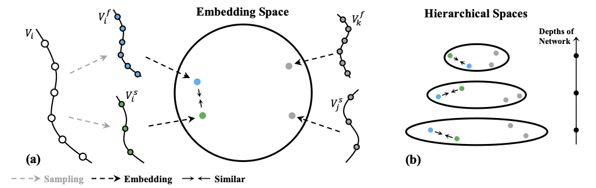

# Video Representation Learning with Visual Tempo Consistency


[[Paper](https://arxiv.org/pdf/2006.15489.pdf)]
[Project Page]

## News
- Full codebae is coming soon

## Pretained Models
For now, we provide the pretrained models of 3D ResNet-18/50 ([link](https://drive.google.com/drive/folders/1Lgzs6GVkAY-oItwF3_RryGGccxbAZS0h?usp=sharing)). This [repo](https://github.com/decisionforce/TPN) supports the action recognition task.

## Bibtex
```
@inproceedings{yang2020vthcl,
  title={Video Representation Learning with Visual Tempo Consistency},
  author={Yang, Ceyuan and Xu, Yinghao and Dai, Bo and Zhou, Bolei},
  booktitle={arXiv preprint arXiv:2006.15489},
  year={2020},
}
```
